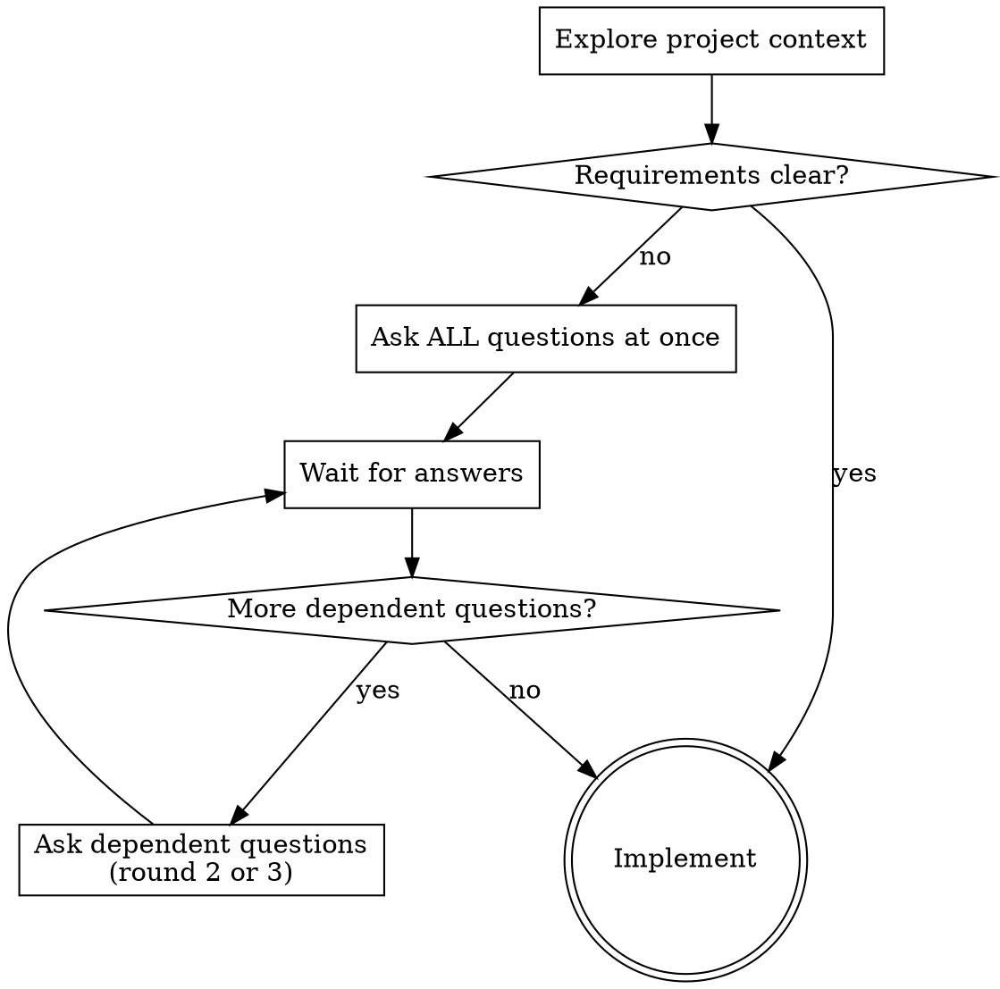

# Brainstorming Ideas Into Designs

Explore the idea, understand requirements, ask questions if needed, then implement.

<HARD-GATE>
Do NOT invoke any implementation skill, write any code, scaffold any project, or take any implementation action until you understand what you're building. If the requirements are clear, skip questions and implement directly.
</HARD-GATE>

## Checklist

Complete these steps in order:

1. **Explore project context** — check files, docs, recent commits
2. **Assess clarity** — are the requirements clear enough to implement?
3. **If unclear: ask ALL questions at once** — every independent question in ONE message
4. **If clear: skip to implementation** — don't ask unnecessary questions
5. **After answers: implement directly** — no design docs, no approval loops

## Process Flow

## Asking Questions

**ALL independent questions in ONE message.** Never ask one question at a time.

- Prefer multiple choice (A/B/C) when possible
- Group related questions together
- Maximum 3 rounds of questions total. After round 3, pick the best options and implement.
- Only DEPENDENT questions (answers that depend on previous answers) go to the next round

Example (all in one message):

1. What language/runtime? (A: TypeScript/Node.js / B: Python / C: Go)
2. Storage approach? (A: In-memory / B: SQLite / C: PostgreSQL)
3. API style? (A: REST / B: GraphQL / C: Library only)
4. Auth needed? (A: Yes, JWT / B: Yes, session-based / C: No auth)

## Exploring Approaches

After understanding requirements:
- Propose 2-3 different approaches with trade-offs
- Lead with your recommendation and explain why
- Present ALL approaches in ONE message

## After Understanding Requirements

Implement directly. Do NOT:
- Write design docs
- Ask for design approval
- Present design sections one at a time
- Invoke writing-plans skill
- Create tasks

**Working in existing codebases:**
- Explore the current structure before proposing changes
- Follow existing patterns
- Don't propose unrelated refactoring

## Key Principles

- **All questions at once** - Never one at a time
- **Multiple choice preferred** - Easier to answer than open-ended
- **YAGNI ruthlessly** - Remove unnecessary features
- **Max 3 rounds** - Then implement with best judgment
- **Clear requirements = skip questions** - Don't ask for the sake of asking
